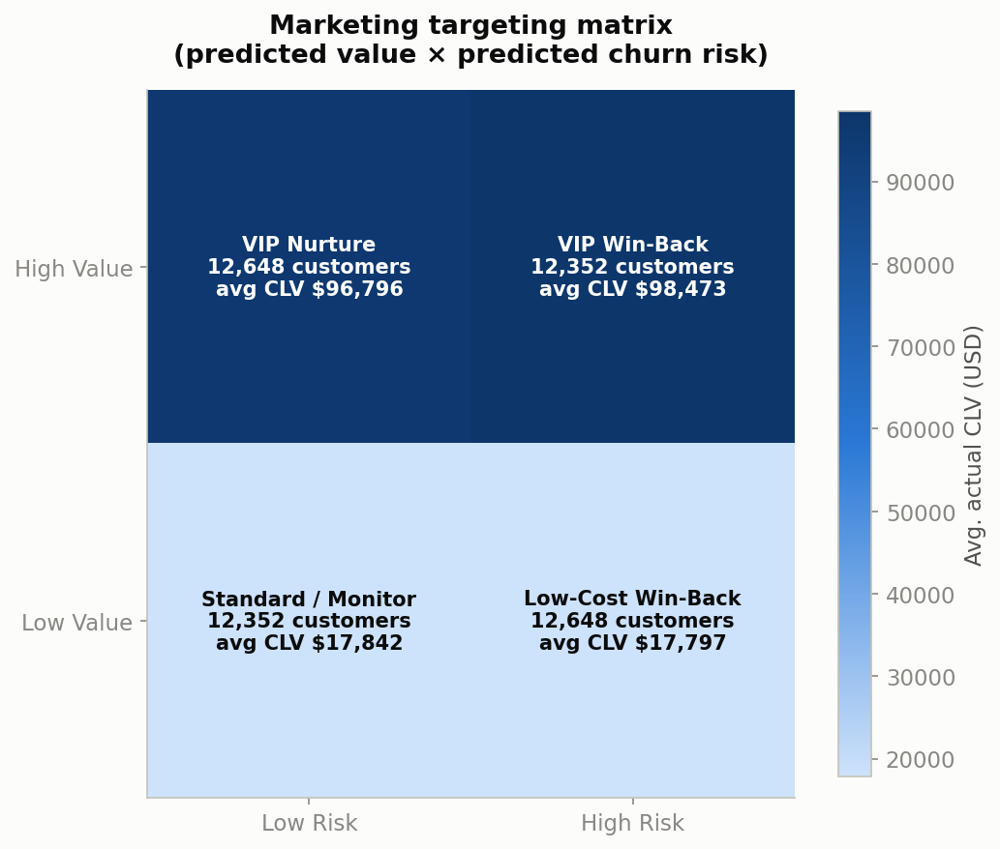
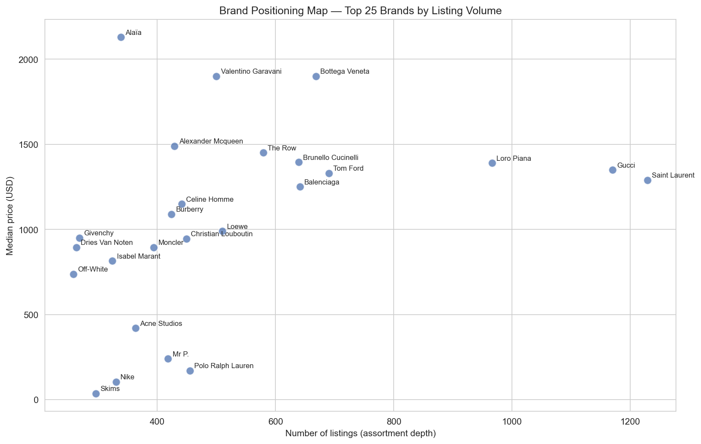
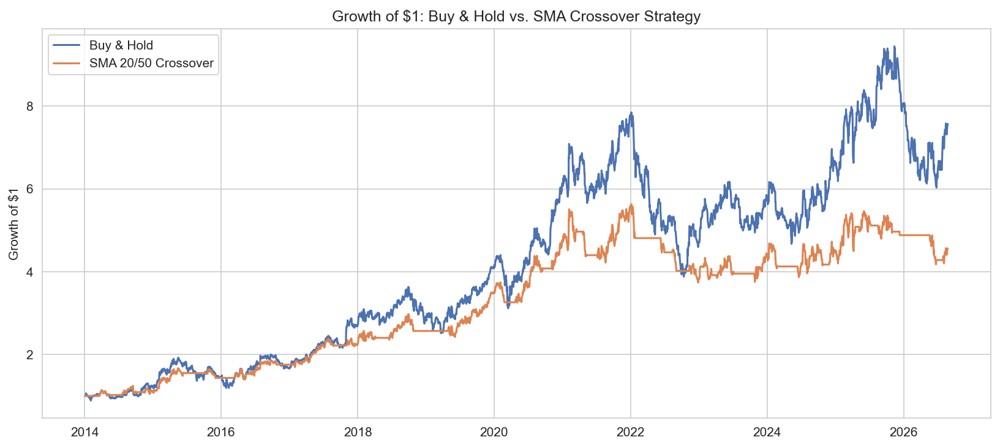

# Alia Alami — Data Analytics Portfolio

**M.S. Business Analytics, UMass Amherst (2026)** · B.S. Mathematics (Statistics & Data Science) · Targeting Data Analyst / Business Analyst roles

I've worked as a data/analytics intern across nonprofit consulting, education-finance policy, legal research, and banking — turning large transactional and program datasets into dashboards, models, and recommendations that stakeholders acted on, including a **$285M+ capital-formation impact dashboard** and a **$5.38M funding-disparity finding** that shaped district budget decisions.

📫 [LinkedIn](https://www.linkedin.com/in/alia-alami) · alia.alami1213@gmail.com

**Tools:** Python (pandas, scikit-learn, statsmodels, TensorFlow/Keras) · SQL · R · Tableau · Power BI · Jupyter

---

## ⭐ Featured projects

### [E-Commerce Customer Segmentation, Churn & CLV](./04-ecommerce-customer-segmentation) — Python · [SQL companion](./09-sql-customer-revenue-analysis)

> **Which customers are most valuable, which are at risk, and where should retention spend go?**

- A value × risk targeting matrix isolates a **$98k-average-CLV "VIP Win-Back" group** of 12,352 customers from an $18k group that only warrants automated outreach — a ~5.5× gap that should drive budget allocation.
- The churn model scores AUC ≈ 1.00 with recency features but **0.489 (random) without them**, so the recommendation is simple inactivity alerts, not a complex model.
- In SQL: the **top 20% of customers generate 48.9% of revenue**, and 534 recently lapsed high-value customers make up the first win-back list.



### [Luxury Fashion Market & Trend Analysis](./08-luxury-fashion-trends) — Python · NLP

> **What does product-description language reveal about which luxury items command a premium?**

- "Quiet luxury" shows up in the data: logo-mentioning items are **cheaper** on average ($450 vs. $627), while cashmere-mentioning items are far **more expensive** ($1,050 vs. $590).
- Sustainability language is associated with **lower** prices ($425 vs. $625 median), not a premium.
- A TF-IDF + logistic regression model predicts premium-for-category pricing from description text alone with **AUC 0.861** across 43,508 listings.



### [Sony Stock — Technical Analysis, Volatility & Backtesting](./06-sony-stock-technical-analysis) — Python · time series

> **Do technical-indicator strategies or forecasts actually beat buying and holding?**

- **ARIMA adds no edge over a naive forecast** — one-step RMSE ties "tomorrow = today" (0.443 vs. 0.443).
- An SMA(20/50) crossover strategy gives up 4.6 points of CAGR (12.8% vs. 17.4%) for ~17 points shallower drawdowns, landing at the **same Sharpe ratio (0.67 vs. 0.68)** — a risk-management tool, not a return enhancer.



---

## 📊 All projects

| # | Project | Question | Headline finding | Methods |
|---|---------|----------|------------------|---------|
| 1 | [HR Employee Attrition](./01-hr-employee-attrition) | Who is leaving, and why? | Overtime employees leave at **30.5% vs. 10.4%** — nearly 3× — and Sales Reps on overtime hit 66.7% | Segmentation, EDA |
| 2 | [Netflix Content Trends](./02-netflix-content-trends) | How has the content strategy shifted? | From 2018 to 2021, TV show additions grew **23%** while movie additions fell **20%** | Text wrangling, trend analysis |
| 3 | [California Home Price Prediction](./03-california-home-price-prediction) | Can demographics and geography predict home value? | Neural network beats OLS (**R² 0.68 vs. 0.62**); inland location cuts expected value by ~50% | OLS, neural network, VIF, diagnostics |
| 4 | [E-Commerce Segmentation, Churn & CLV](./04-ecommerce-customer-segmentation) | Where should retention spend go? | **$98k vs. $18k** average CLV between win-back groups | K-Means, Random Forest, regression |
| 5 | [Online Food Delivery Behavior](./05-online-food-delivery-analysis) | Who orders, and can it be predicted? | Single respondents order at **85.4% vs. 61.1%** for married; income alone misleads | Crosstabs, classification |
| 6 | [Sony Stock Technical Analysis](./06-sony-stock-technical-analysis) | Do indicators beat buy & hold? | Same Sharpe ratio (**0.67 vs. 0.68**); ARIMA ties a naive forecast | Technical indicators, ARIMA, backtesting |
| 7 | [Red Wine Quality](./07-red-wine-quality) | What makes a wine "good"? | Logistic regression (**AUC 0.876**) beats a tuned decision tree and a random forest | Classification, `GridSearchCV`, ROC/AUC |
| 8 | [Luxury Fashion Trends](./08-luxury-fashion-trends) | What language signals a premium price? | Description text alone predicts premium pricing at **AUC 0.861** | TF-IDF, classification |
| 9 | [Customer Revenue & Retention in SQL](./09-sql-customer-revenue-analysis) | Where does revenue come from, and who is worth winning back? | Top 20% of customers generate **48.9%** of revenue; churn is ~30% in every spend decile | SQL: CTEs, window functions, joins |

Each project folder contains a `README.md` (business question, approach, findings, recommendations), the full executed work (`analysis.ipynb`, or `.sql` files for project 9), and the exported charts or query results.

## 🚀 Run a project locally

```bash
git clone https://github.com/aliaalami1213/data-analyst-portfolio.git
cd data-analyst-portfolio
pip install -r requirements.txt
```

Data is included in each project's `data/` folder, so the notebooks run as-is. The exception is project 3, which fetches its data at runtime (see its `data/README.md`). Project 9 builds its SQLite database from project 4's CSV with `python build_db.py`.
